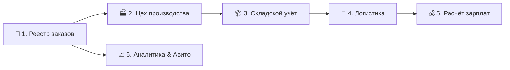

# 🏛️ Руководство по «Сулак CRM» для презентации команде

Данный документ — это **полный путеводитель и шпаргалка для руководителя** при демонстрации системы сотрудникам. Он построен по разделам и ролям, чтобы вы ничего не упустили во время показа.

---

## 🎯 Главная цель системы
**Сулак CRM** — это единый цифровой центр управления производством и продажами мебели (столы, стулья, гарнитуры). Система связывает в одну цепочку:
`Продажи в amoCRM/Авито ➔ Оформление заказа ➔ Производственный цех ➔ Склад ➔ Логистику и доставку ➔ Расчёт зарплат`

---

## 🧭 Пошаговый план презентации по разделам

---

### 1. 📊 Дашборд (Обзор платформы)
**Что рассказать сотрудникам:**
- **Главный экран управления**: Здесь виден пульт управления бизнесом в реальном времени.
- **Ключевые показатели**: Текущая выручка за день/месяц, количество заказов в работе, просроченные доставки и задержки в производстве.
- **Визуальные графики**: Показывают динамику продаж и загрузку производства.

---

### 2. 🛒 Реестр заказов (Сердце продаж)
**Что показать менеджерам:**
1. **Быстрое создание заказа**:
   - Автоматический выбор клиента с защитой от дубликатов по номеру телефона.
   - Поиск по каталогу товаров с мгновенным подбором размеров столов, количества стульев и цвета.
2. **Точный расчёт стоимости**:
   - Автоматический расчёт суммы заказа, размера скидки, стоимости доставки и сборки.
3. **Печать документов**:
   - Генерация готового печатного бланка заказа / накладной для клиента в один клик.
4. **Управление статусами**:
   - Прозрачный жизненный цикл: *Ожидает ➔ Подтверждён ➔ На производстве ➔ На складе ➔ Доставляется ➔ Доставлен / Отменён*.
   - При отмене заказа система требует обязательно указать причину.

---

### 3. 🏭 Цех производства (Модуль мастеров)
**Что показать началу производства и мастерам:**
- **Разделение на подзаказы**: Если в заказе есть и стол, и 6 стульев, система сама разделяет его на отдельные задачи для столяров (столы) и швей/обойщиков (стулья).
- **Отслеживание готовности**: Мастер на производстве видит свои задачи и меняет статус готовности прямо со смартфона или планшета.
- **Сроки выполнения**: Красная подсветка подсказывает, какие позиции требуют срочной отгрузки.

---

### 4. 📦 Складской учёт (Модуль кладовщика)
**Что показать кладовщику:**
- **Остатки готовой продукции**: Видно, сколько столов и стульев готово и лежит на складе.
- **Контроль материалов**: Учёт фурнитуры, ткани, дерева и лакокрасочных материалов.
- **Алерты дефицита**: Система предупреждает, если запасы материалов подходят к концу.

---

### 5. 🚚 Логистика и Экипажи водителей
**Что показать логисту и водителям:**
- **Формирование рейсов**: Логист распределяет заказы по конкретным водителям и автомобилям.
- **Маршрутный лист водителя**: Водитель со своего телефона видит список адресов, телефоны клиентов, суммы к оплате и комментарии по доставке.
- **Статусы в реальном времени**: При нажатии водителем кнопки *«Доставляется»* или *«Доставлен»* система мгновенно обновляет статус и уведомляет менеджера.

---

### 6. 💰 Расчет зарплаты (ФОТ)
**Что показать бухгалтеру и сотрудникам:**
- **Прозрачная сделка**: Автоматический расчёт сдельщины мастеров за каждый изготовленный стол или стул.
- **Оплата логистики**: Автоматический расчёт оплаты водителям за рейсы и точки доставки.
- **Бонусы менеджеров**: Начисление процента от закрытых продаж.
- **Без ручных записей**: Больше никаких споров по зарплате — всё прозрачно фиксируется в системе.

---

### 7. 📈 Аналитика amoCRM & Дневной отчёт
**Что показать отделу продаж:**
- **Интеграция с amoCRM**: Точный учёт лидов, входящих звонков, новых и повторных сообщений.
- **Сверка конверсии**: Сравнение количества входящих обращений с реальными проданными заказами.
- **Фильтрация по датам**: Просмотр статистики за любой день или период по московскому времени.

---

### 8. 🤖 Автоматика Telegram & Авито
**Что показать всем (фишки автоматизации):**
1. **Единый Telegram-чат с тегами**:
   Все ключевые события приходят в рабочий чат с хэштегами для быстрого поиска:
   - `#новый_заказ` — при создании заказа.
   - `#доставляется` — при передаче водителю.
   - `#доставлен` — при вручении клиенту (с напоминанием менеджеру запросить отзыв!).
   - `#отмена` — при отмене с причиной.
   - `#отзыв_авито` — при поступлении отзыва на Авито.
2. **Мониторинг 7 аккаунтов Авито**:
   Бот каждые 60 минут опрашивает все 7 аккаунтов Авито и присылает **только новые отзывы**, исключая дубликаты.

---

## 📋 Чек-лист руководителю перед показательной презентацией

- [ ] Открыть **Дашборд** и показать общие цифры компании.
- [ ] Зайти в **Реестр заказов** и создать тестовый заказ (показать выбор размеров стола и количество стульев).
- [ ] Сменить статус заказа на *«На производстве»* и открыть **Цех производства**.
- [ ] Передать заказ в **Логистику**, назначить водителя и перевести в *«Доставляется»*.
- [ ] Показать сообщение в **Telegram-чате** с тегом `#доставляется`.
- [ ] Перевести статус в *«Доставлен»* и зайти в **Расчёт зарплаты**, чтобы показать, как автоматически начислилась выплата за этот заказ.
- [ ] Открыть **Настройки $\rightarrow$ Авито** и нажать кнопку проверки отзывов.

---

*Документ подготовлен для команды «Сулак». Все модули синхронизированы и готовы к работе.*
